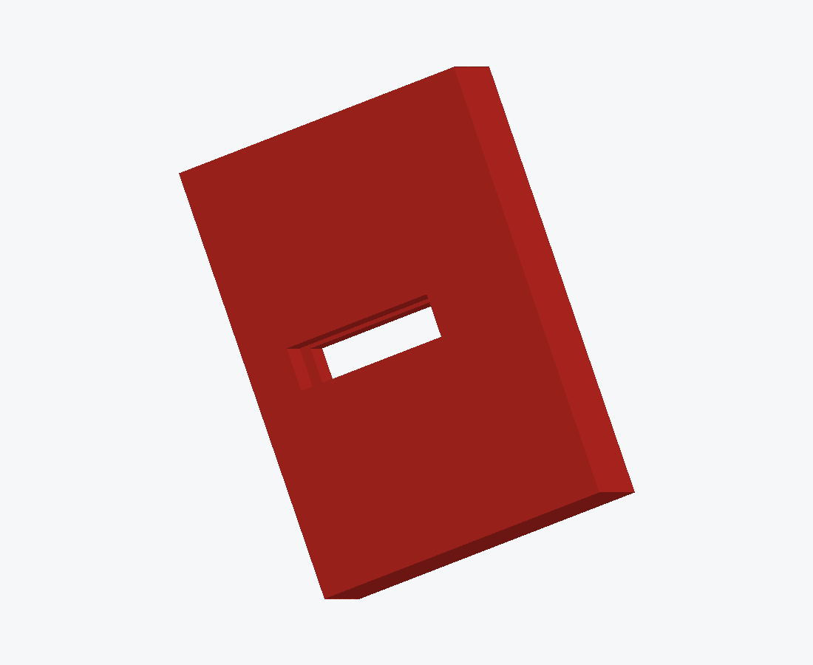
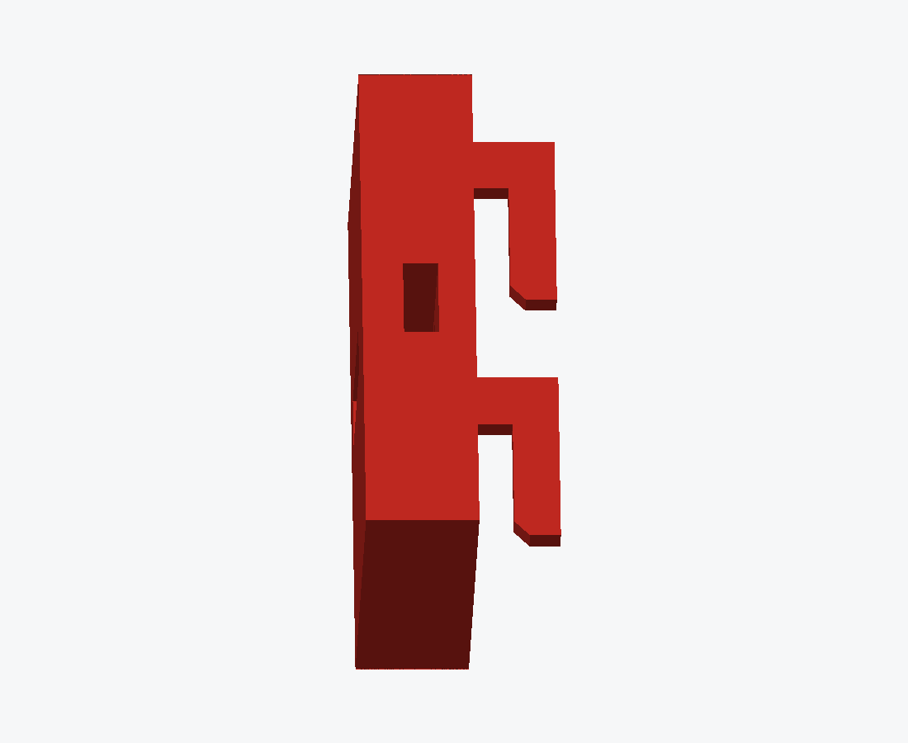
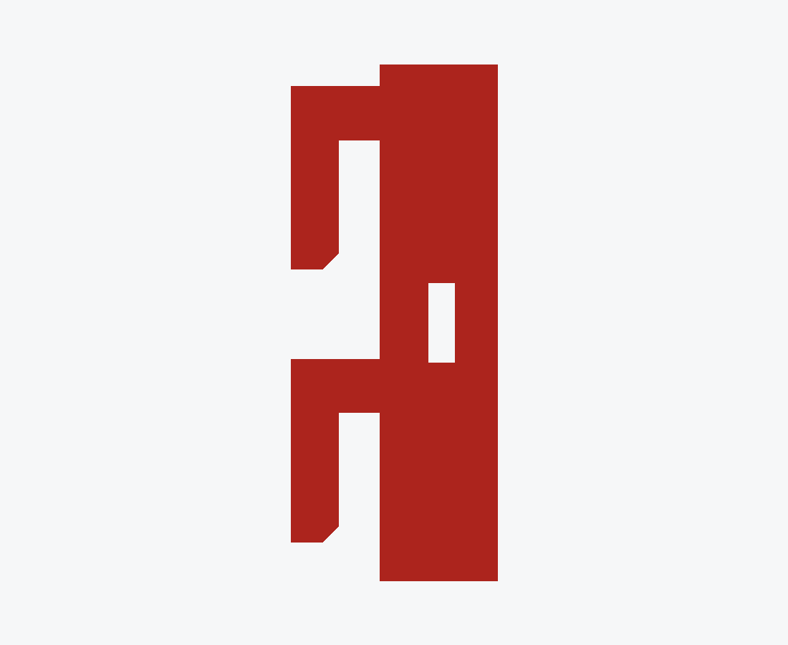

# LAN SKÅDIS Mount

Hang an IKEA SKÅDIS pegboard — or a sheet of hardware-store pegboard — on
the slotted DuraFrame uprights of an Ergotron LAN Organizer 3000. No
drilling into the frame, no wall, no rail. The brackets hook into the slots
that are already there.

Grown out of [lan-spool-shelf](https://github.com/mhuot/lan-spool-shelf);
the hook that grips the upright is the one already fit-verified on the real
desk.

<p align="center">
  
  
  
</p>

## The parts

| Part | Script | State |
| --- | --- | --- |
| **SKÅDIS captured-nut bracket** | `build_skadis_nut_bracket.py` | current design |
| Pegboard bolt-through bracket | `build_pegboard_bracket.py` | for 1/4"-hole pegboard |

### The joint

A **DIN 562 M4 square nut** lives in a cavity *inside* the plate:

- The cavity is enclosed on the board side by **4 mm of solid wall**. The
  board lands on a flat face; nothing but the screw slot breaks it.
- It breaks out of the plate's **outboard edge and nowhere else**, so the
  nut slides in from the side with the bracket in your hand, before it ever
  goes on the desk.
- It is **12 mm longer than the nut**, and that length is the left-right
  adjustment. Slide, then tighten.
- It is **7.4 mm tall against a 7.0 mm nut**, well under the nut's 9.9 mm
  diagonal, so the nut cannot rotate and the screw can be tightened
  one-handed from the front.
- The IKEA decorative M4 screw goes in through the board, through the wall,
  into the nut, and its tip passes behind the nut in the same slot.
  Tightening pulls the nut **forward onto the wall** and clamps the board
  between the screw head and the plate.

## Measured, not assumed

Every dimension in this project that was assumed turned out to be wrong, and
every one that was measured has held. These are the measured ones.

| What | Value | Note |
| --- | --- | --- |
| Upright slot | 3/4" tall, 1" pitch, ~1/8" wide | one column per upright |
| Slot column spacing | **735.04 mm** | 28 13/16" between facing slot edges, plus one slot width |
| SKÅDIS board thickness | **6.0 mm** | *not* the 4.6 mm the community libraries quote |
| SKÅDIS slot | 5 × 15 mm on a 40 mm grid | second grid offset 20 mm both ways |
| Decorative M4 screw | **15 mm** | the one IKEA ships |

A DIN 562 M4 square nut is confirmed to fit the cavity as built.

## The plate thickness is derived, not chosen

```
plateThickness = screwLength - boardThickness + screwTipClearance
               = 15.0 - 6.0 + 2.0
               = 11.0 mm
```

A 15 mm screw through a 6 mm board leaves 9 mm behind the board with nowhere
to go — a thinner plate would let the tip stand proud of its own back face
and jam against the upright's steel. Change the screw and the plate follows;
the build refuses outright if the tip comes within 0.5 mm of the back face,
or if it would bottom out inside the nut's cavity instead of passing behind
it.

At the worst nut position, a bracket's share of a 15 kg loaded board works
out to 0.118 MPa against PETG's ~50 MPa — a 400× margin — which is why the
inboard extension carries no stiffening rib.

## Mounting: the two grids do not agree

One channel per bracket, four brackets per board, two per upright. That
moves vertical alignment out of the part and into the assembly — where the
upright's **25.4 mm** pitch has to meet the board's **40 mm** pitch. A screw
has 11 mm of freedom inside its 15 mm slot, so only some spacings work:

| Brackets apart | Board rows | Mismatch | |
| --- | --- | --- | --- |
| 3 × 25.4 = **76.2 mm** | 2 × 40 = 80 mm | 3.8 mm | ✅ |
| 8 × 25.4 = **203.2 mm** | 5 × 40 = 200 mm | 3.2 mm | ✅ better leverage |
| 2 × 25.4 = 50.8 mm | 1 × 40 = 40 mm | 10.8 mm | ❌ of 11.0 available |
| 1 × 25.4 = 25.4 mm | 1 × 40 = 40 mm | 14.6 mm | ❌ |

`build_skadis_nut_bracket.py` prints this list on every run, so it cannot
get lost. The left and right brackets are mirrored: each puts its channel
7.52 mm toward the centre of the desk, which is where the board's nearest
slot column falls at a 735.04 mm upright spacing.

## Printing

Lay the bracket on a side face — model Y vertical — so the hook profile is
drawn inside every layer instead of stacked across them. In that orientation
**the cavity and the screw slot need no support at all** (they run along the
build direction), and organic supports grow only under the two hooks.

Put the **inboard edge on the bed**, so the cavity's blind end is at the
bottom and its mouth opens at the top. That is `--rotate-x -90` for the
**left** bracket and `--rotate-x 90` for the **right** — the two hands are
mirrored, so they do not share a rotation.

Getting this backwards does not fail loudly. Mouth-down looks like the
obvious choice — the cavity opens at the bed and prints as a plain vertical
channel — but it puts the *blind* end at the top, where its ceiling is a
horizontal overhang, and the slicer dutifully fills the whole cavity with
support you can never get out. Sliced both ways, supports reach z 29.0 mouth
down against z 21.6 mouth up, and only the second stops at the hooks.

- **ASA** for the real set: it creeps less than PETG under the permanent
  tension in the hooks. PETG is fine for a fit test.
- 4 perimeters, 40% infill. The stock "STRUCTURAL" profiles are thinner
  than that.
- Supports touch the *side face of the hook tabs* — the face that enters the
  slot. Caliper a tab after cleanup: nominal 2.4 mm, and it has to stay
  under about 2.6 mm to enter a 3.2 mm slot.
- PETG welds itself to organic supports; a 0.25 mm contact distance breaks
  away cleanly without the lips drooping.

About 8 g and 35–40 minutes per bracket.

## Building the models

Everything is parametric in Fusion 360, driven through its local MCP server.

```sh
python3 scripts/run_in_fusion.py scripts/build_skadis_nut_bracket.py --variant left
python3 scripts/run_in_fusion.py scripts/build_skadis_nut_bracket.py --variant right
python3 scripts/run_in_fusion.py scripts/build_skadis_nut_bracket.py --variant coupon
```

`--variant coupon` is a stub of the real cross-section carrying one channel:
about 3 g and 13 minutes, and the cheap way to check a nut before committing
to four brackets.

Each run exports `cad/*.step`, `cad/*.f3d` and `exports/*.stl` together, so
they cannot drift apart. Locally, in `.venv`:

```sh
.venv/bin/python scripts/check_stl.py exports/skadis_nut_left.stl 16864
.venv/bin/python scripts/build_web_assets.py       # the GLBs the page loads
.venv/bin/python scripts/render_part.py exports/skadis_nut_left.stl out.png
```

Every user parameter drives geometry, with lengths in mm, angles in degrees
and counts unitless — the build fails if that stops being true, and
`scripts/audit_parameters.py` checks documents that were edited by hand.

## Attribution

This project started from [Skadis to Kallax mount adapter](https://www.printables.com/model/137113-skadis-to-kallax-mount-adapter)
by **WegBier**, licensed CC BY-NC-SA, which is where the idea of mounting to
SKÅDIS with a printed part rather than bolting through it came from. That
licence is incompatible with this repository's MIT licence, so **none of
that model's geometry has ever been reproduced here**, and this design
shares no feature with it.

SKÅDIS interface dimensions are measurements of IKEA's product rather than
anyone's authorship, cross-checked against
[franpoli/OpenSCADutil](https://github.com/franpoli/OpenSCADutil) and
[TassSinclair/skadis](https://github.com/TassSinclair/skadis), then
re-measured on the board itself.

IKEA, SKÅDIS, Ergotron and DuraFrame are trademarks of their respective
owners. This project is not affiliated with either company.

## Licence

MIT — see [LICENSE](LICENSE).
